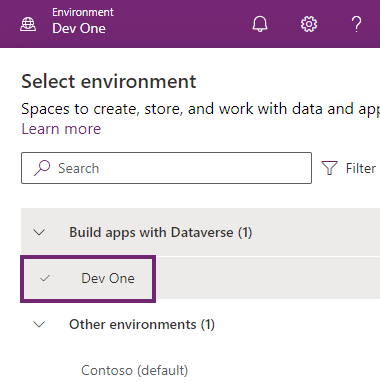

---
lab:
  title: 'Lab 0: Lab-Umgebung überprüfen'
  module: 'Module 0: Course Introduction'
---

# Übungslab 0: Überprüfen der Labumgebung

> **WICHTIG:** In diesem Lab erhalten Sie einen Microsoft 365-Mandanten und Lizenzen für die Power Platform-Anwendungen, die Sie in diesem Kurs verwenden werden. Sie erhalten nur einen einzigen Mandanten für die Übungslabs in diesem Kurs. Die Einstellungen und Aktionen, die Sie in diesem Mandanten vornehmen, werden nicht zurückgesetzt, doch Ihre bereitgestellte VM wird jedes Mal zurückgesetzt, wenn Sie die Labsitzung schließen. Beachten Sie, dass sich Microsoft 365 und Power Platform ständig weiterentwickeln. Die Anweisungen in diesem Dokument unterscheiden sich möglicherweise von in Ihrem tatsächlichen Mandanten. Es ist auch möglich, dass es zu einer Verzögerung von einigen Minuten kommt, bevor der virtuelle Computer über Netzwerkkonnektivität verfügt, um die Labs zu beginnen.

## WWL-Mandanten – Nutzungsbedingungen

Wenn Ihnen im Rahmen einer Präsenzschulung ein Mandant zugewiesen worden ist, steht dieser für Praxislabs innerhalb der Präsenzschulung zur Verfügung.

Mandanten sollten nicht für Zwecke außerhalb von Praxislabs freigegeben oder verwendet werden. Der in diesem Kurs verwendete Mandant ist ein Testmandant; er kann nach Abschluss des Kurses nicht verwendet oder erreicht werden und ist nicht für Erweiterungen geeignet.

Mandanten dürfen nicht in ein kostenpflichtiges Abonnement konvertiert werden. Die im Rahmen dieses Kurses erworbenen Mandanten verbleiben im Eigentum der Microsoft Corporation, und wir behalten uns das Recht vor, jederzeit auf Mandanten zuzugreifen und diese zurückzuziehen.

## Übung 1: Zugreifen auf Microsoft Power Platform

In dieser Übung überprüfen Sie, ob Sie auf Power Apps zugreifen können.

### Aufgabe 1.1: Anmelden bei Power Apps

1. Vergewissern Sie sich, dass Ihre **Microsoft 365-Anmeldeinformationen** vom autorisierten Labhost verfügbar sind. Sie finden die Anmeldeinformationen auf der Registerkarte **Ressourcen**.

1. Navigieren Sie auf einer neuen Browserregisterkarte zu `https://powerapps.microsoft.com`.

1. Wählen Sie **anmelden** aus.

1. Geben Sie die vom autorisierten Labhost bereitgestellte `email address` ein.

1. Wählen Sie **Weiter** aus.

1. Geben Sie die vom autorisierten Labhost bereitgestellte `password` ein.

1. Wählen Sie **anmelden** aus.

1. Optional können Sie **Ja** auswählen, um angemeldet zu bleiben.

1. Wählen Sie optional Nein, danke aus, um sich bei Microsoft Edge anzumelden.

1. Wenn Sie zur Eingabe von Kontaktinformationen aufgefordert werden, behalten Sie für Land/Region die Standardwerte bei, geben Sie `0123456789` als Telefonnummer ein, und wählen Sie **Übermitteln** aus.

1. Überprüfen Sie oben rechts auf dem Bildschirm, ob die **Umgebung** auf **Dev One** festgelegt ist. Hier arbeiten Sie während des gesamten Labs. Wenn sie nicht festgelegt ist, wählen Sie die Umgebung **Dev One** aus.

    

### Aufgabe 1.2 – Browser aktualisieren

Das Anwenden der neuesten Updates auf den Browser verhindert Probleme in der nächsten Übung beim Erstellen von Apps.

1. Öffnen Sie den **Microsoft Edge**-Browser.

1. Wählen Sie die **Befehle (...)** oben rechts im Browser, wählen Sie **Hilfe und Feedback** und anschließend **Über Microsoft Edge**.

1. Wenden Sie Updates an, und starten Sie den Browser bei Bedarf neu.

## Übung 2 – Microsoft Teams

In dieser Übung überprüfen Sie, ob Sie auf ein Team in Microsoft Teams zugreifen können.

### Aufgabe 2.1 – Anmelden bei Microsoft Teams

1. Vergewissern Sie sich, dass Ihre **Microsoft 365-Anmeldeinformationen** vom autorisierten Labhost verfügbar sind. Sie finden die Anmeldeinformationen auf der Registerkarte **Ressourcen**.

1. Navigieren Sie auf einer neuen Browserregisterkarte zu `https://teams.microsoft.com`.

1. Wenn Sie aufgefordert werden, Teams kennenzulernen, wählen Sie **Erste Schritte** aus, und schließen Sie das Popupfenster.

1. Erweitern Sie **Teams und Kanal**.

1. Wählen Sie **Alle Teams anzeigen** aus.

### Aufgabe 2.2 – Erstellen eines Teams

1. Wenn keine Teams angezeigt werden, wählen Sie oben rechts auf der Seite **Team erstellen** aus.

1. Geben Sie `Contoso` in das Feld **Teamname** ein.

1. Geben Sie `General` in the Feld **Name des ersten Kanals** ein.

1. Klicken Sie auf **Erstellen**.

1. Wählen Sie **Überspringen** aus.
