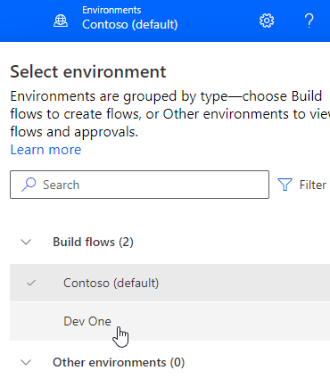
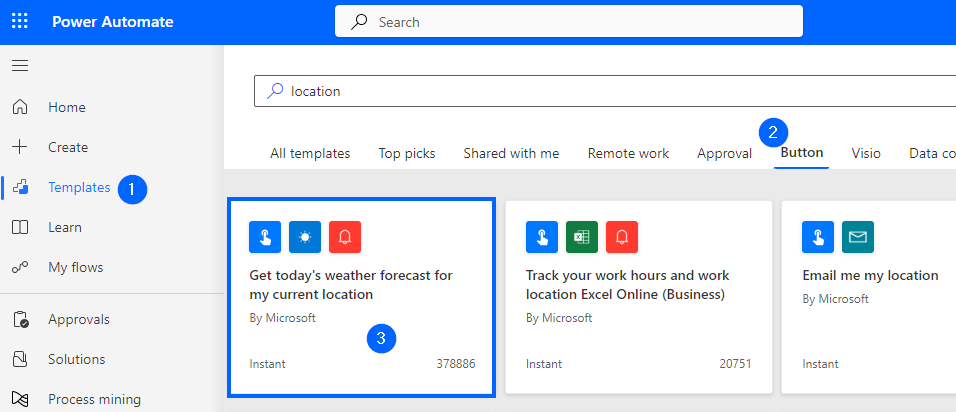
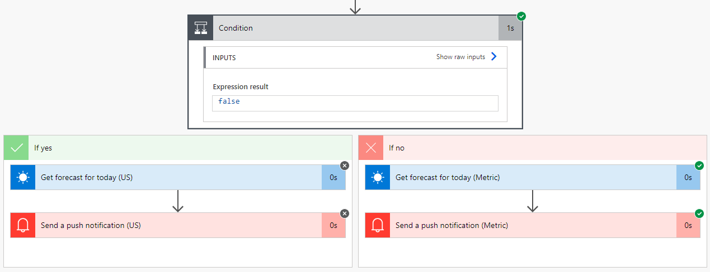
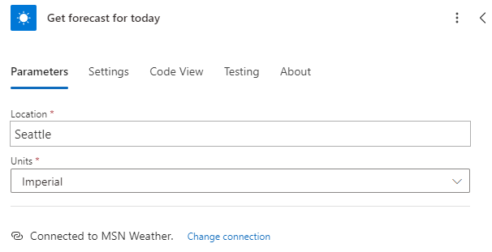
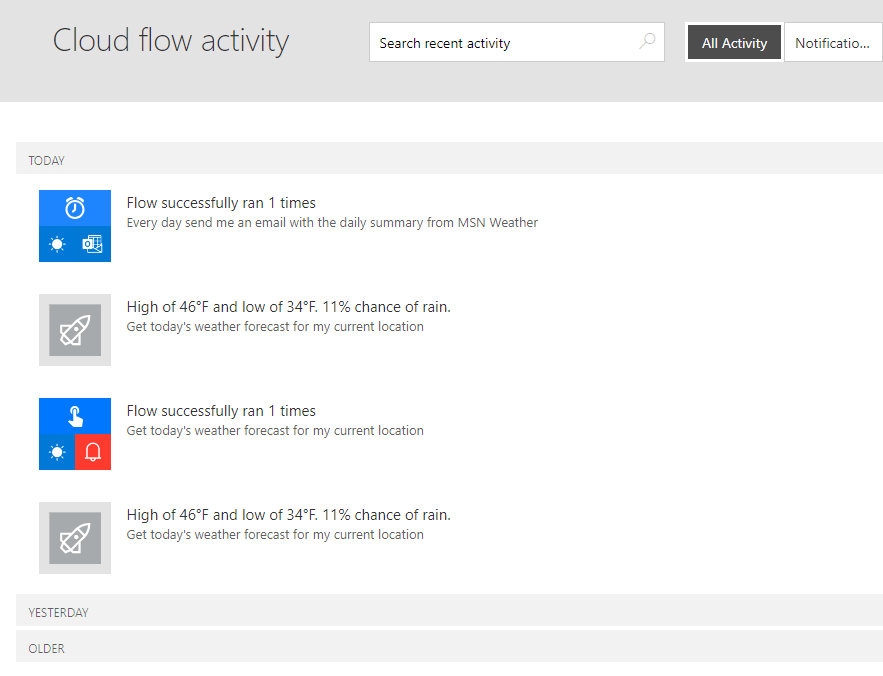

---
lab:
  title: 'Lab 1: Cloud-Flows zu erstellen'
  module: 'Module 1: Get started with Power Automate'
---

# Übungslab 1 – Erstellen von Cloud-Flows

In diesem Lab erstellen Sie Cloud-Flows.

## Lernziele

- Erstellen von Power Automate-Cloud-Flows aus einer Vorlage und mit CoPilot
- So erstellen Sie einen Power Automate-Cloud-Flow von Grund auf neu und fügen Aktionen hinzu

## Weiterführende Schritte des Lab

- Cloud-Flow aus einer Vorlage erstellen
- Erstellen eines Cloud-Flows mit CoPilot
- Einen Cloud-Flow erstellen
- Überwachen der Cloud-Flowaktivitäten
  
## Voraussetzungen

- Sie müssen Folgendes abgeschlossen haben: **Lab 0: Lab-Umgebung überprüfen**

## Ausführliche Schritte

## Übung 1 – Erstellen eines Cloud-Flows aus einer Vorlage

### Aufgabe 1.1: Auswählen einer Vorlage

1. Navigieren Sie zum Power Automate-Portal <https://make.powerautomate.com>.

1. Wählen Sie die Umgebung **Dev One** aus.

    

1. Wählen Sie im linken Menü die Registerkarte **Vorlagen** aus.

1. Wählen Sie die Registerkarte **Schaltfläche** aus.

1. Geben Sie `location` in das Suchfeld ein.

    

1. Wählen Sie **Heutigen Wetterbericht für meinen aktuellen Standort abrufen** aus.

    

1. Wählen Sie **Erstellen** für **MSN Wetter** aus.

1. Wählen Sie **Erstellen** für **Benachrichtigungen** aus.

1. Wählen Sie **Flow erstellen** aus.

    

### Aufgabe 1.2: Ausführen des Flows

1. Klicken Sie auf **Run** (Ausführen).

1. Wenn Sie dazu aufgefordert werden, wählen Sie für **Standort freigeben** **Zulassen** aus.

1. Wählen Sie **Continue** (Weiter) aus.

1. Wählen Sie **Flow ausführen** aus.

1. Wählen Sie **Fertig** aus.

    

### Aufgabe 1.3: Überprüfen des Flows

1. Wählen Sie das Datum und die Uhrzeit im Flow-Ausführungsverlauf aus.

    

1. Wählen Sie den Schritt **Bedingung** aus, um die Flow-Schritte zu erweitern.

    

1. Wählen Sie den Schritt **Vorhersage für heute abrufen** mit dem grünen Häkcken aus.

    

1. Wählen Sie **Bearbeiten** aus.

1. Wählen Sie den Schritt **Bedingung** aus, um die Flow-Schritte zu erweitern.

1. Wählen Sie **Bedingung erweitern** aus.

1. Wählen Sie einen der Schritte unter **Pushbenachrichtigung senden** aus.

1. Wählen Sie **Flowprüfung** aus. Es sollten keine Fehler oder Warnungen auftreten.

1. Schließen Sie den Bereich **Flowprüfung**.

### Aufgabe 1.4: Testen des Flows

1. Wählen Sie **Testen**, dann **Automatisch**, anschließend **Mit einem kürzlich verwendeten Trigger** und dann die Flowausführung aus.

    

1. Klicken Sie auf **Test**.

1. Wählen Sie die Schaltfläche „Zurück“ **<-** oben links in der Befehlsleiste aus.

## Übung 2 – Erstellen eines Cloud-Flows mit CoPilot

### Aufgabe 2.1: Eingeben eines Prompts

1. Navigieren Sie zum Power Automate-Portal <https://make.powerautomate.com>.

1. Stellen Sie sicher, dass Sie sich in der Umgebung **Dev One** befinden.

1. Wählen Sie im linken Menü die Registerkarte **Home** aus.

1. Geben Sie unter **Lassen Sie uns etwas automatisieren. Was soll es tun?** nun `Every day send me an email with the daily summary from MSN Weather` ein.

    

1. Wählen Sie **Generieren** aus.

    

1. Wählen Sie **Weiter** aus.

1. Wählen Sie **Flow erstellen** aus.

    

### Aufgabe 2.2: Konfigurieren des Flowschritts

1. Wählen Sie den Schritt **Vorhersage für heute abrufen** aus.

    

1. Geben Sie `Seattle` für **Ort** ein.

1. Wählen Sie das **X** aus, um **Einheiten** zu löschen, und wählen Sie in der Dropdownliste **Imperial** aus.

1. Wählen Sie **Speichern** aus.

1. Den Flow testen

1. Wählen Sie die Schaltfläche „Zurück“ **<-** oben links in der Befehlsleiste aus.

## Übung 3 – Erstellen eines Cloud-Flows von Grund auf neu

### Aufgabe 3.1: Erstellen des Triggers

1. Navigieren Sie zum Power Automate-Portal <https://make.powerautomate.com>.

1. Stellen Sie sicher, dass Sie sich in der Umgebung **Dev One** befinden.

1. Wählen Sie im linken Menü die Registerkarte **+ Erstellen** aus.

1. Wählen Sie dann **Automatisierter Cloud-Flow** aus.

1. Geben Sie `Important email` als **Flowname** ein.

1. Geben Sie `email` in das Suchfeld ein.

1. Wählen Sie **Bei Eingang einer neuen E-Mail (V3)** aus.

    

1. Klicken Sie auf **Erstellen**.

### Aufgabe 3.2: Konfigurieren des Triggers

1. Wählen Sie den Schritt **Bei Eingang einer neuen E-Mail (V3)** aus.

1. Wählen Sie **Alle anzeigen** aus.

    

1. Wählen Sie unter **Anlagen einschließen** die Option **Nein** aus.

1. Wählen Sie für **Wichtigkeit** die Einstellung **Hoch** aus.

1. Wählen Sie **Posteingang** als **Ordner**aus.

### Aufgabe 3.3: Hinzufügen einer Aktion

1. Wählen Sie unter dem Trigger-Schritt das Symbol **+** und dann **Aktion hinzufügen** aus.

1. Geben Sie `notification` in das Suchfeld ein.

    

1. Wählen Sie unter **Microsoft Teams** die Option **Feedbenachrichtigung posten** aus.

1. Wählen Sie **anmelden** aus.

1. Verwenden Sie Ihre Mandantenanmeldeinformationen.

1. Wählen Sie **Team** als **Benachrichtigungstyp** aus.

1. Geben Sie Ihre Mandantenbenutzer-ID als **Empfänger** ein.

1. Wählen Sie das Feld **Benachrichtigungstext** und dann das Symbol „Dynamischer Inhalt“ aus.

    

1. Wählen Sie **Betreff** aus.

1. Wählen Sie **Contoso** als **Team** aus.

1. Wählen Sie **Allgemein** als **Kanal** aus.

1. Wählen Sie **Speichern**.

1. Wählen Sie die Schaltfläche „Zurück“ **<-** oben links in der Befehlsleiste aus.

## Übung 4 –Überwachen von Flows

### Aufgabe 4.1: Cloud-Flowaktivität

1. Navigieren Sie zum Power Automate-Portal <https://make.powerautomate.com>.

1. Stellen Sie sicher, dass Sie sich in der Umgebung **Dev One** befinden.

1. Klicken Sie auf **... Weitere** im linken Menü.

    

1. Wählen Sie das Symbol „Anheften“ als **Cloud-Flowaktivität** aus.

1. Wählen Sie im linken Menü die Registerkarte **Cloud-Flowaktivität** aus.

    
