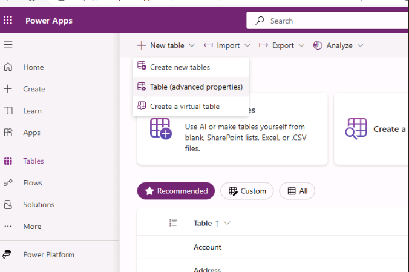
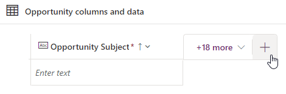

---
lab:
  title: "Lab\_2: Datenmodell"
  module: 'Module 2: Get started with Microsoft Dataverse'
---

# Übungslab 2: Datenmodell

In diesem Lab erstellen Sie Dataverse-Tabellen und -Spalten.

## Lernziele

- Gewusst wie: Erstellen von Tabellen und Spalten in Microsoft Dataverse
- Gewusst wie: Erstellen einer Beziehung mit einer Lookupspalte

## Weiterführende Schritte des Lab

- Eine benutzerdefinierte Tabelle erstellen
- Einer Tabelle Spalten hinzufügen
- Erstellen einer Beziehung mithilfe einer Lookupspalte
  
## Voraussetzungen

- Sie müssen Folgendes abgeschlossen haben: **Lab 0: Überprüfen der Labumgebung**

## Ausführliche Schritte

## Übung 1: Erstellen benutzerdefinierter Tabellen

### Aufgabe 1.1: Erstellen der Opportunity-Tabelle

1. Navigieren Sie zum Power Apps Maker-Portal `https://make.powerapps.com`.

1. Stellen Sie sicher, dass Sie sich in der Umgebung **Dev One** befinden.

1. Wählen Sie im linken Navigationsbereich **Tabellen** aus.

1. Wählen Sie **+ Neue Tabelle** und dann **Spalten und Daten hinzufügen** aus.

    

1. Wählen Sie **Tabelleneigenschaften bearbeiten** aus.

    

1. Geben Sie für **Anzeigename** `Opportunity` ein.

1. Wählen Sie **Speichern**.

### Aufgabe 1.2: Primäre Spalte

1. Wählen Sie das Dropdown-Caretzeichen neben **Neue Spalte** und danach **Spalte bearbeiten** aus.

    

1. Geben Sie für **Anzeigename** `Opportunity Subject` ein.

1. Wählen Sie **Aktualisieren**.

1. Klicken Sie auf **Erstellen**.

### Aufgabe 1.3: Hinzufügen von Spalten

1. Wählen Sie im Bereich **„Opportunity“-Spalten und -Daten** **+** aus, um eine neue Spalte hinzuzufügen.

    

1. Geben Sie im Bereich **Neue Spalte** die folgenden Werte ein, oder wählen Sie diese aus:

   1. Anzeigename: `Owner Name`
   1. Datentyp: **Einzelne Textzeile**
   1. Erforderlich: **Business erforderlich**

    

1. Wählen Sie **Speichern**.

1. Wählen Sie im Bereich **„Opportunity“-Spalten und -Daten** **+** aus, um eine neue Spalte hinzuzufügen.

1. Geben Sie im Bereich **Neue Spalte** die folgenden Werte ein, oder wählen Sie sie aus:

   1. Anzeigename: `Customer`
   1. Datentyp: **Einzelne Textzeile**
   1. Erforderlich: **Business erforderlich**

1. Wählen Sie **Speichern**.

1. Geben Sie im Bereich **Neue Spalte** die folgenden Werte ein, oder wählen Sie sie aus:

   1. Anzeigename: `Address`
   1. Datentyp: **Einzelne Textzeile**
   1. Erforderlich: **Optional**

1. Klappen Sie **Erweiterte Optionen** auf und geben Sie `200` als **Maximale Zeichenanzahl** ein.

1. Wählen Sie **Speichern**.

1. Wählen Sie im Bereich **„Opportunity“-Spalten und -Daten** **+** aus, und geben Sie im Bereich **Neue Spalte** die folgenden Werte ein, oder wählen Sie sie aus:

   1. Anzeigename: `Estimated Close Date`
   1. Datentyp: **Datum und Uhrzeit**
   1. Format: **Nur Datum**
   1. Erforderlich: **Optional**

1. Wählen Sie **Speichern**.

1. Wählen Sie im Bereich **„Opportunity“-Spalten und -Daten** **+** aus, und geben Sie im Bereich **Neue Spalte** die folgenden Werte ein, oder wählen Sie sie aus:

   1. Anzeigename: `Amount`
   1. Datentyp: **Währung**
   1. Erforderlich: **Optional**

1. Wählen Sie **Speichern**.

1. Wählen Sie im Bereich **„Opportunity“-Spalten und -Daten** **+** aus, und geben Sie im Bereich **Neue Spalte** die folgenden Werte ein, oder wählen Sie sie aus:

   1. Anzeigename: `Notes`
   1. Datentyp: **Mehrere Textzeilen**
   1. Format: **Text**
   1. Erforderlich: **Optional**

1. Wählen Sie **Speichern**.

### Aufgabe 1.4: Hinzufügen einer Auswahlspalte

1. Wählen Sie im Bereich **„Opportunity“-Spalten und -Daten** **+** aus, und geben Sie im Bereich **Neue Spalte** die folgenden Werte ein, oder wählen Sie sie aus:

   1. Anzeigename: `Status`
   1. Datentyp: **Auswahl** > **Auswahl**
   1. Erforderlich: **Optional**

1. Wählen Sie **Nein** für **Mit globaler Auswahl synchronisieren?** aus.

1. Geben Sie `New` für **Bezeichnung** ein, und geben Sie `1` für **Wert** ein.

1. Wählen Sie **+ Neue Auswahl** aus, und geben Sie `Open` für **Bezeichnung** sowie `2` für **Wert** ein.

1. Wählen Sie **+ Neue Auswahl** aus, und geben Sie `Closed` für **Bezeichnung** ein, und geben Sie `3` für **Wert** ein.

1. Wählen Sie **Neu** als **Standardauswahl** aus.

    

1. Wählen Sie **Speichern**.

## Übung 2: Erstellen einer Beziehung

### Aufgabe 2.1: Erstellen einer Lookupspalte

1. Navigieren Sie zum Power Apps Maker-Portal `https://make.powerapps.com`.

1. Stellen Sie sicher, dass Sie sich in der Umgebung **Dev One** befinden.

1. Wählen Sie im linken Navigationsbereich **Tabellen** aus.

1. Wählen Sie **Verkaufschance** aus.

1. Wählen Sie im Bereich **„Opportunity“-Spalten und -Daten** **+** aus, und geben Sie im Bereich **Neue Spalte** die folgenden Werte ein, oder wählen Sie sie aus:

   1. Anzeigename: `Account`
   1. Datentyp: **Suche**
   1. Erforderlich: **Optional**
   1. Verwandte Tabelle: **Konto**

    

1. Wählen Sie **Speichern**.

## Übung 3: Daten

### Aufgabe 3.1: Hinzufügen von „Opportunity“-Datensätzen

1. Navigieren Sie zum Power Apps Maker-Portal `https://make.powerapps.com`.

1. Stellen Sie sicher, dass Sie sich in der Umgebung **Dev One** befinden.

1. Wählen Sie im linken Navigationsbereich **Tabellen** aus.

1. Wählen Sie **Verkaufschance** aus.

1. Wählen Sie im Bereich **„Opportunity“-Spalten und -Daten** das Dropdown-Caretzeichen neben **Bearbeiten** aus, und wählen Sie dann **Auf der neuen Registerkarte bearbeiten** aus.

1. Geben Sie die folgenden Werte ein bzw. wählen Sie diese aus.

   1. Thema zur Opportunity: `100 Widgets`
   1. Name des Besitzers: `MOD Administrator`
   1. Kunde: `Adventure Works`
   1. Geschätztes Abschlussdatum: **Datum im vorherigen Monat auswählen**
   1. Betrag: `10,000`
   1. Status: **Geschlossen**

1. Wählen Sie **Zeile unterhalb einfügen** aus, und geben Sie die folgenden Werte ein, oder wählen Sie sie aus:

   1. Thema zur Opportunity: `Key customer`
   1. Name des Besitzers: `MOD Administrator`
   1. Kunde: `Fabrikam`
   1. Geschätztes Abschlussdatum: **Zukünftiges Datum im aktuellen Monat auswählen**
   1. Status: **Neu**
   1. Betrag: `50,000`

1. Wählen Sie **Zeile unterhalb einfügen** aus, und geben Sie die folgenden Werte ein, oder wählen Sie sie aus:

   1. Thema zur Opportunity: `New customer`
   1. Name des Besitzers: `MOD Administrator`
   1. Kunde: `Coho Winery`
   1. Geschätztes Abschlussdatum: **Zukünftiges Datum im nächsten Monat auswählen**
   1. Betrag: `25,000`
   1. Status: **Neu**

1. Wählen Sie **Zeile unterhalb einfügen** aus, und geben Sie die folgenden Werte ein, oder wählen Sie sie aus:

   1. Thema zur Opportunity: `Repeat customer`
   1. Name des Besitzers: `MOD Administrator`
   1. Kunde: `Fourth Coffee`
   1. Geschätztes Abschlussdatum: **Zukünftiges Datum im nächsten Monat auswählen**
   1. Betrag: `15,000`
   1. Status: **Öffnen**

    

1. Schließen Sie die Registerkarte.
