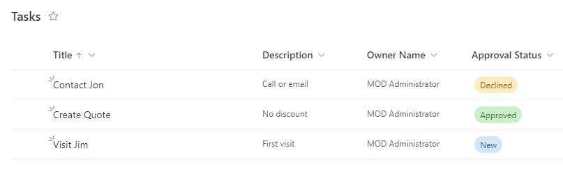

---
lab:
  title: "Lab\_3: SharePoint"
  module: 'Module 3: Build approval flows with Power Automate'
---

# Übungs-Lab 3 – SharePoint

In diesem Lab erstellen Sie eine SharePoint-Website und -Liste.

## Lernziele

- Erstellen einer SharePoint-Liste
- Hochladen von Daten

## Weiterführende Schritte des Lab

- Erstellen einer SharePoint-Liste für Verkaufschancen
  
## Voraussetzungen

- Sie müssen Folgendes abgeschlossen haben: **Lab 0: Überprüfen der Labumgebung**

## Ausführliche Schritte

## Übung 1: Erstellen einer SharePoint-Liste

### Aufgabe 1.1 Erstellen einer SharePoint-Website

1. Im Power Apps Maker-Portal, `https://make.powerapps.com`

1. Wählen Sie das **App-Startfeld** oben links im Browserfenster und dann **SharePoint**.

1. Wenn das Popup-Dialogfeld **Willkommen auf der SharePoint-Startseite** angezeigt wird, wählen Sie **X** aus, um das Dialogfeld zu schließen.

1. Wählen Sie in SharePoint **+ Website erstellen** aus.

1. Wählen Sie **Teamwebsite**, die Vorlage **Standardteam** und dann **Vorlage verwenden** aus.

1. Geben Sie `Power Automate` als **Websitename** ein, und wählen Sie **Weiter** aus.

1. Wählen Sie **Standort anlegen**.

1. Wählen Sie **Fertig stellen**aus.

1. Wenn das Popupdialogfeld **Mit dem Entwerfen Ihrer Website beginnen** angezeigt wird, schließen Sie das Dialogfeld.

### Aufgabe 1.2 Erstellen einer SharePoint-Liste

1. Wählen Sie auf der SharePoint-Website **+ Neu** und dann **Liste** aus.

    

1. Wählen Sie unter **Aus leerem Dokument erstellen** die Option **Liste**.

1. Geben Sie `Tasks` als **Name** ein, und wählen Sie **Erstellen** aus.

1. Wählen Sie **+ Spalte hinzufügen** und dann **Mehrere Textzeilen** aus, und wählen Sie **Weiter** aus.

1. Geben Sie im Bereich **Erstellen einer Spalte** die folgenden Werte ein, oder wählen Sie sie aus:

   1. Name: `Description`
   1. Typ: **Mehrere Textzeilen**

1. Wählen Sie **Speichern**.

1. Wählen Sie **+Spalte hinzufügen** und **Text** aus, und wählen Sie **Weiter** aus.

1. Geben Sie im Bereich **Erstellen einer Spalte** die folgenden Werte ein, oder wählen Sie sie aus:

   1. Name: `Owner Name`
   1. Typ: **Einzelne Textzeile**

1. Wählen Sie **Speichern**.

1. Wählen Sie **+ Spalte hinzufügen** und dann **Datum und Uhrzeit** aus, und wählen Sie **Weiter** aus.

1. Geben Sie im Bereich **Erstellen einer Spalte** die folgenden Werte ein, oder wählen Sie sie aus:

   1. Name: `Deadline`
   1. Typ: **Datum und Uhrzeit**

1. Wählen Sie **Speichern**.

1. Wählen Sie **+Spalte hinzufügen**, **Auswahl** und dann **Weiter** aus.

1. Geben Sie im Bereich **Erstellen einer Spalte** die folgenden Werte ein, oder wählen Sie sie aus:

   1. Name: `Approval Status`
   1. Typ: **Auswahl**
   1. Auswahl 1 =`New`
   1. Auswahl 2 =`Approved`
   1. Auswahl 3 =`Declined`

1. Wählen Sie **Neu** für den **Standardwert** aus.

    

1. Wählen Sie **Speichern**.

1. Kopieren Sie den ersten Teil der URL der SharePoint-Website, z. B. `https://m365x99999999.sharepoint.com/sites/PowerAutomate/`.

## Übung 2 – Hinzufügen einer SharePoint-Datenliste

### Aufgabe 2.1 – Hinzufügen von Daten

1. Navigieren Sie zur SharePoint-Website, und wählen Sie die **Aufgabenliste** aus.

    

1. Wählen Sie **+ Neues Element hinzufügen** aus und geben Sie die folgenden Daten ein und klicken Sie auf **Speichern**:

   1. Titel = `Contact Jon`
   1. Beschreibung =`Call or email`
   1. Name des Besitzers =`MOD Administrator`
   1. Deadline =**Gestern**
   1. Genehmigungsstatus =**Abgelehnt**

1. Wählen Sie **+ Neues Element hinzufügen** aus und geben Sie die folgenden Daten ein und klicken Sie auf **Speichern**:

   1. Titel = `Create Quote`
   1. Beschreibung =`No discount`
   1. Name des Besitzers = `MOD Administrator`
   1. Deadline =**Heute**
   1. Genehmigungsstatus =**Genehmigt**

1. Wählen Sie **+ Neues Element hinzufügen** aus und geben Sie die folgenden Daten ein und klicken Sie auf **Speichern**:

   1. Titel = `Visit Jim`
   1. Beschreibung =`First visit`
   1. Name des Besitzers =`MOD Administrator`
   1. Deadline =**Morgen**
   1. Genehmigungsstatus =**Neu**

    

