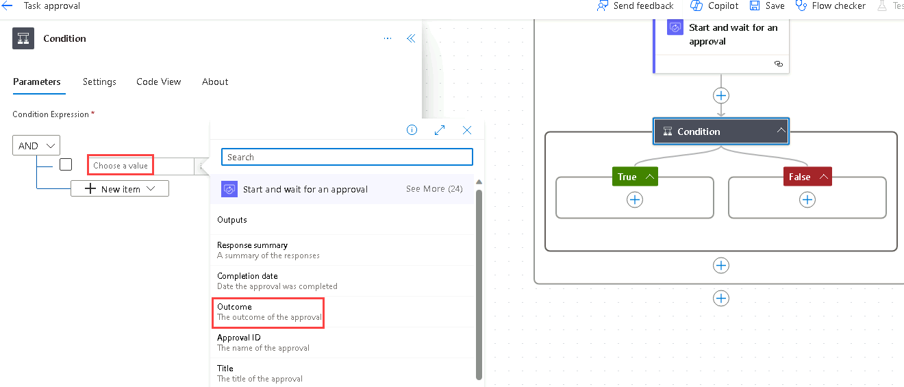

---
lab:
  title: "Lab\_4: Genehmigungsflow"
  module: 'Module 3: Build approval flows with Power Automate'
---

# Übungslab 4 – Genehmigungsflow

In diesem Lab erstellen Sie einen Genehmigungsflow.

## Lernziele

- So erstellen Sie einen Power Automate-Cloud-Flow für Genehmigungen

## Weiterführende Schritte des Lab

- Erstellen eines automatisierten Cloud-Flows für die SharePoint-Liste
- Genehmigung erstellen
- Hinzufügen einer Bedingung für das Genehmigungsergebnis
- Testen des Flows
  
## Voraussetzungen

- Sie müssen Folgendes abgeschlossen haben: **Lab 3: SharePoint**

## Ausführliche Schritte

## Übung 1: Erstellen eines Genehmigungsflows

### Aufgabe 1.1: Erstellen des Triggers

1. Navigieren Sie zum Power Automate-Portal `https://make.powerautomate.com`.

1. Stellen Sie sicher, dass Sie sich in der Umgebung **Dev One** befinden.

1. Wählen Sie in der linken Navigationsleiste die Registerkarte **+ Erstellen**.

1. Wählen Sie **Automatisierter Cloud-Flow** aus.

1. Geben Sie `Task approval` als **Flowname** ein.

1. Geben Sie `SharePoint` unter „Alle Trigger suchen“ ein.

1. Wählen Sie **Wenn ein Element erstellt wird** aus.

1. Klicken Sie auf **Erstellen**.

### Aufgabe 1.2: Konfigurieren des Triggers

1. Wählen Sie den Schritt **Wenn ein Element erstellt wird** aus.

1. Wählen Sie den Schritt **Wenn ein Element erstellt wird** aus, und geben Sie `New task` ein.

1. Wählen Sie die **SharePoint-Website für Power Automate aus**, die in der vorherigen Übung erstellt wurde. Wenn die Website nicht aufgeführt ist, wählen Sie **Benutzerdefinierten Wert eingeben** ein, und fügen Sie die URL der SharePoint-Website für Power Automate ein.

1. Wählen Sie die Liste **Aufgaben** aus.

    

### Aufgabe 1.3: Hinzufügen einer Genehmigungsaktion

1. Wählen Sie unter dem Trigger-Schritt das Symbol **+** und dann **Aktion hinzufügen** aus.

1. Geben Sie `approval` in das Suchfeld ein.

    

1. Wählen Sie unter **Genehmigungen** die Option **Starten und auf Genehmigung warten** aus.

1. Wählen Sie **Neu erstellen** aus.

1. Wählen Sie **Genehmigen/ablehnen: Erste Antwort** als **Genehmigungstyp** aus.

1. Wählen Sie den Schritt **Starten und auf eine Genehmigung warten** und geben Sie `Approval` ein.

1. Geben Sie `/` in das Feld **Titel** ein und wählen Sie **Dynamischen Inhalt einfügen**.

1. Wählen Sie **Titel** unter **Neue Aufgabe**.

    

1. Geben Sie für **Zugewiesen zu** Ihre Mandantenbenutzer-ID ein.

1. Geben Sie `/` in das Feld **Details** ein und wählen Sie **Dynamischen Inhalt einfügen**.

1. Wählen Sie **Beschreibung** aus.

1. Geben Sie `/` in das Feld **Elementverknüpfung** ein und wählen Sie **Dynamischen Inhalt einfügen** aus. 

1. Wählen Sie **Mehr anzeigen**, wählen Sie **Verknüpfung zum Artikel**.

### Aufgabe 1.4: Hinzufügen einer Bedingung

1. Wählen Sie unter dem Genehmigungsschritt das Symbol **+** und dann **Aktion hinzufügen** aus.

1. Geben Sie `condition` in das Suchfeld ein.

1. Wählen Sie **Bedingung** unter "**Steuerelement** aus.

1. Geben Sie `/` in das linke Feld **Wählen Sie einen Wert** ein und wählen Sie **Dynamischen Inhalt einfügen**.

    

1. Wählen Sie **Ergebnis** aus.

1. Wählen Sie die Option **ist gleich** als **Operator** aus.

1. Wählen Sie das rechte Feld **Wählen Sie einen Wert** und geben Sie `Approve` ein

    

### Aufgabe 1.5: Aktionen zum Aktualisieren des Status

1. Wählen Sie das Symbol **+** unter **True** und dann **Aktion hinzufügen** aus.

1. Geben Sie `update item` in das Suchfeld ein.

1. Wählen Sie **Element aktualisieren** unter **SharePoint** aus.

1. Wählen Sie **Element aktualisieren** Schrittname und geben Sie `Set task to approved` ein.

1. Wählen Sie die **Power Automate-SharePoint-Site** aus.

1. Wählen Sie die Liste **Aufgaben** aus.

1. Geben Sie `/` in das Feld **Id** ein und wählen Sie **Dynamischen Inhalt einfügen**.

1. Wählen Sie **ID** aus **Neue Aufgabe**.

1. Wählen Sie unter **Erweiterte Parameter** die Option **Alle anzeigen** aus.

1. Geben Sie `/` in das Feld **Titel** ein und wählen Sie **Dynamischen Inhalt einfügen**.

1. Wählen Sie unter **Neue Aufgabe** die Option **Titel** aus.

1. Wählen Sie **Genehmigt** als **Genehmigungsstatuswert** aus.

1. Wählen Sie das Symbol **+** unter **False** und dann **Aktion hinzufügen** aus.

1. Geben Sie `update item` in das Suchfeld ein.

1. Wählen Sie **Element aktualisieren** unter **SharePoint** aus.

1. Wählen Sie den Schritt **Element 1 aktualisieren** aus, und geben Sie `Set task to declined` ein.

1. Wählen Sie die **Power Automate-SharePoint-Site** aus.

1. Wählen Sie die Liste **Aufgaben** aus.

1. Geben Sie `/` in das Feld **Id** ein und wählen Sie **Dynamischen Inhalt einfügen**.

1. Wählen Sie **ID** aus **Neue Aufgabe**.

1. Wählen Sie **Alle anzeigen** aus.

1. Geben Sie `/` in das Feld **Titel** ein und wählen Sie **Dynamischen Inhalt einfügen**.

1. Wählen Sie unter **Neue Aufgabe** die Option **Titel** aus.

1. Wählen Sie **Abgelehnt** als **Genehmigungsstatuswert** aus.

1. Wählen Sie **Speichern**.

1. Wählen Sie die Schaltfläche „Zurück“ **<-** oben links in der Befehlsleiste aus.

## Übung 2 – Testen der Genehmigung

### Aufgabe 2.1: Auslösen des Genehmigungsflows

1. Navigieren Sie zur SharePoint-Website, und wählen Sie die Liste **Aufgaben** aus.

1. Wählen Sie **+ Neues Element hinzufügen** aus und geben Sie die folgenden Daten ein und klicken Sie auf **Speichern**:

   1. Titel = `Approval test`
   1. Beschreibung = `Test`
   1. Name des Besitzers = `MOD Administrator`
   1. Stichtag = **Heute**
   1. Genehmigungsstatus = **Neu**

### Aufgabe 2.2: Statusgenehmigung

1. Navigieren Sie zum Power Automate-Portal `https://make.powerautomate.com`.

1. Stellen Sie sicher, dass Sie sich in der Umgebung **Dev One** befinden.

1. Wählen Sie die Registerkarte **Meine Flows** im linken Navigationsmenü.

1. Wählen Sie **Aufgabengenehmigung** aus.

1. Wählen Sie das Datum und die Uhrzeit im Flow-Ausführungsverlauf aus.

    > **Hinweis:** Die Genehmigungsfunktion wird im Hintergrund installiert. Dies dauert ca. 10 Minuten.

1. Wählen Sie die Registerkarte **Genehmigungen** aus dem linken Navigationsmenü.

    

1. Wählen Sie den **Genehmigungstest**, dann **Teilstrich** und anschließend **Bestätigen** aus.

1. Wählen Sie **Fertig** aus.

1. Wählen Sie die Registerkarte **Meine Flows** im linken Navigationsmenü.

1. Wählen Sie **Aufgabengenehmigung** aus.

1. Wählen Sie das Datum und die Uhrzeit im **28-Tage-Ausführungsverlauf**.

1. Navigieren Sie zur SharePoint-Website, und wählen Sie die Liste **Aufgaben** aus.

1. Überprüfen Sie, ob der **Genehmigungsstatus** des Elements **Genehmigungstest** **Genehmigt** lautet.

