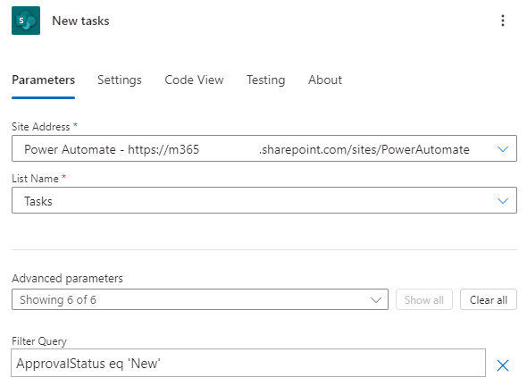

---
lab:
  title: 'Lab 6: Geplanter Flow'
  module: 'Module 5: Power Automate’s deep integration across multiple data sources'
---

# Übungslab 6: Geplanter Flow

In diesem Lab erstellen Sie einen geplanten Flow.

## Lernziele

- Erstellen eines geplanten Power Automate-Flows und Verarbeiten einer Liste von SharePoint-Elementen

## Weiterführende Schritte des Lab

- Geplanten Flow erstellen
- Abfragen einer SharePoint-Liste
- Datenvorgänge verwenden
- Testen des Flows
  
## Voraussetzungen

- Sie müssen Folgendes abgeschlossen haben: **Lab 3: SharePoint**

## Ausführliche Schritte

## Übung 1: Erstellen eines geplanten Flows

### Aufgabe 1.1: Erstellen des Triggers

1. Navigieren Sie zum Power Automate-Portal `https://make.powerautomate.com`.

1. Stellen Sie sicher, dass Sie sich in der Umgebung **Dev One** befinden.

1. Wählen Sie im linken Navigationsmenü die Registerkarte **+ Erstellen** aus.

1. Wählen Sie **Geplanter Cloud-Flow** aus.

1. Geben Sie `Daily New Tasks` als **Flowname** ein.

1. Setzen Sie **Wiederholung alle** auf **1****Tag**.

    

1. Klicken Sie auf **Erstellen**.

### Aufgabe 1.2: Konfigurieren des Triggers

1. Wählen Sie den Schritt **Serie** aus.

1. Wählen Sie die Schrittbezeichnung **Wiederholung** und geben Sie `Daily` ein.

### Aufgabe 1.3: Abfragen neuer Aufgaben

1. Wählen Sie unter dem Trigger-Schritt das Symbol **+** und dann **Aktion hinzufügen** aus.

1. Geben Sie `list items` in das Suchfeld ein.

1. Wählen Sie unter **SharePoint** die Option **Elemente abrufen** aus.

1. Wählen Sie den Schritt **Elemente abrufen** und geben Sie `New tasks` ein.

1. Wählen Sie die **Power Automate-SharePoint-Site** aus.

1. Wählen Sie die Liste **Aufgaben** aus.

1. Wählen Sie unter **Erweiterte Parameter** die Option **Alle anzeigen**.

1. Wählen Sie das Feld **Filterabfrage** aus, und geben Sie `ApprovalStatus eq 'New'` ein.

    

### Aufgabe 1.4: Auswählen von Spalten

1. Wählen Sie das Symbol **+** unter dem Schritt **Neue Aufgaben** und wählen Sie **Eine Aktion hinzufügen**.

1. Geben Sie `Select` in das Suchfeld ein.

1. Wählen Sie für **Runtime** die Option **Integriert** aus.

1. Wählen Sie **Auswählen** unter **Datenvorgang**.

1. Wählen Sie das Feld **Von** und das Symbol „Dynamischer Inhalt“ aus.

1. Wählen Sie unter **Neue Aufgaben** die Option **Textkörper/Wert** aus.

1. Wählen Sie das Feld **Eingabetaste** und geben Sie `Task` ein.

1. Wählen Sie das Feld **Wert eingeben** und dann das Symbol „Dynamischer Inhalt“ aus.

1. Wählen Sie unter **Neue Aufgaben** die Option **Titel** aus.

1. Wählen Sie das Feld **Eingabetaste** und geben Sie `Description` ein.

1. Wählen Sie das Feld **Wert eingeben** und dann das Symbol „Dynamischer Inhalt“ aus.

1. Wählen Sie unter **Neue Aufgaben** die Option **Beschreibung** aus.

1. Wählen Sie das Feld **Eingabetaste** und geben Sie `Due` ein.

1. Wählen Sie das Feld **Wert eingeben** aus, klicken Sie auf das Symbol „Dynamischer Inhalt“ und wählen Sie dann **Weitere anzeigen** aus.

1. Wählen Sie unter **Neue Aufgaben** die Option **Stichtag** aus.

    

1. Wenn der Designer für den Ablauf automatisch eine oder mehrere For Each-Schleifen hinzugefügt hat, ziehen Sie den Select-Schritt außerhalb der Schleifen, und löschen Sie die Schleife(n).

    

### Aufgabe 1.5: Erstellen einer Tabelle

1. Wählen Sie unter dem Schritt „Auswählen“ das Symbol **+** und dann **Aktion hinzufügen** aus.

1. Geben Sie `create html` in das Suchfeld ein.

1. Wählen Sie **HTML-Tabelle erstellen** unter **Datenvorgang** aus.

1. Wählen Sie den Schritt **HTML-Tabelle erstellen** und geben Sie `Format as HTML table` ein.

1. Wählen Sie das Feld **Von** und das Symbol „Dynamischer Inhalt“ aus.

1. Wählen Sie unter **Auswählen** die Option **Ausgabe** aus.

    

### Aufgabe 1.6: Senden einer E-Mail

1. Wählen Sie das Symbol **+** unter dem Schritt **Als HTML-Tabelle formatieren** und wählen Sie **Eine Aktion hinzufügen**.

1. Geben Sie `email` in das Suchfeld ein.

1. Wählen Sie unter **Office 365 Outlook** die Option **E-Mail senden (V2)** aus.

1. Wählen Sie den Schritt **E-Mail senden (V2)** und geben Sie `Notify by email` ein.

1. Wählen Sie das Feld **An** und dann **Benutzerdefinierten Wert eingeben** aus.

1. Geben Sie für **An** Ihre Mandantenbenutzer-ID ein.

1. Wählen Sie das Feld **Betreff** und geben Sie `Daily Tasks` ein.

1. Wählen Sie das Feld **Textkörper** und dann das Symbol „Dynamischer Inhalt“ aus.

1. Wählen Sie unter **Als HTML-Tabelle formatieren** die Option **Ausgabe** aus.

1. Wählen Sie **Speichern**.

## Übung 2: Testen des geplanten Flows

### Aufgabe 2.1: Manuelles Ausführen des geplanten Flows

1. Wählen Sie **Testen** aus.

1. Wählen Sie **Manuell** aus.

1. Klicken Sie auf **Test**.

1. Wählen Sie **Flow ausführen** aus.

1. Wählen Sie **Fertig** aus.

1. Wählen Sie im Power Automate-Portal oben links im Browserfenster das **App-Startfeld** und dann **Outlook** aus.

    

