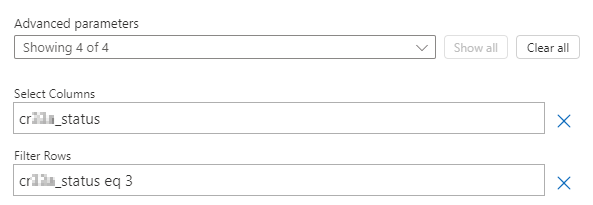

---
lab:
  title: 'Lab 7: Triggerfilter'
  module: 'Module 5: Power Automate’s deep integration across multiple data sources'
---

# Übungs-Lab 7 – Triggerfilter

In diesem Lab filtern Sie nach einem Updatetrigger.

## Lernziele

- So filtern Sie Trigger

## Weiterführende Schritte des Lab

- Erstellen eines automatisierten Flows
- Hinzufügen eines Spaltenfilters
- Hinzufügen eines Abfragefilters

## Voraussetzungen

- Sie müssen **Lab 2: Datenmodell** abgeschlossen haben

## Ausführliche Schritte

## Übung 1 – Schemaname

### Aufgabe 1.1 – Spaltenschemaname

1. Navigieren Sie zum Power Apps Maker-Portal `https://make.powerapps.com`.

1. Stellen Sie sicher, dass Sie sich in der Umgebung **Dev One** befinden.

1. Wählen Sie im linken Navigationsbereich **Tabellen** aus.

1. Wählen Sie **Verkaufschance** aus.

1. Wählen Sie unter **Schema** **Spalten** aus.

1. Wählen Sie die Spalte **Status** aus.

    

1. Erweitern Sie **Erweiterte Optionen**.

    

1. Kopieren Sie den **Logischen Namen** zur Verwendung im Flow.

   > **Hinweis:** Das Präfix für Ihre Statusspalte kann sich unterscheiden.

## Übung 2 – Erstellen eines automatisierten Flows

### Aufgabe 2.1 – Erstellen des Triggers

1. Navigieren Sie zum Power Automate-Portal `https://make.powerautomate.com`.

1. Stellen Sie sicher, dass Sie sich in der Umgebung **Dev One** befinden.

1. Wählen Sie im linken Navigationsmenü die Registerkarte **+ Erstellen** aus.

1. Wählen Sie **Automatisierter Cloud-Flow** aus.

1. Geben Sie `Opportunity Closed` als **Flowname** ein.

1. Geben Sie `Dataverse` in allen Triggern in die Suche ein.

1. Wählen Sie **Wann eine Zeile hinzugefügt, geändert oder gelöscht wird**.

1. Klicken Sie auf **Erstellen**.

### Aufgabe 2.2: Den Trigger konfigurieren

1. Wählen Sie den Schritt **Wann eine Zeile hinzugefügt, geändert oder gelöscht wird** aus.

1. Wählen Sie die Schrittbezeichnung **Wenn eine Zeile hinzugefügt, geändert oder gelöscht wird** und geben Sie `Opportunity changed` ein.

1. Wählen Sie **Geändert** als **Änderungstyp** aus.

1. Wählen Sie **Möglichkeiten** für **Tabellenname**.

1. Wählen Sie **Organisation** als **Bereich** aus.

    

### Aufgabe 2.3: E-Mail senden

1. Wählen Sie unter dem Trigger-Schritt das Symbol **+** aus, und wählen Sie **Aktion hinzufügen** aus.

1. Geben Sie `email` in die Suche ein.

1. Wählen Sie unter **Office 365 Outlook** die Option **E-Mail senden (V2)** aus.

1. Wählen Sie den Schritt **E-Mail senden (V2)** und geben Sie `Notify by email` ein.

1. Wählen Sie das Feld **An** und dann **Benutzerdefinierten Wert eingeben** aus.

1. Geben Sie für **An** Ihre Mandantenbenutzer-ID ein.

1. Wählen Sie das Feld **Betreff** und geben Sie `Opportunity closed` ein.

1. Wählen Sie das Feld **Textkörper** und das Symbol „Dynamischer Inhalt“ aus.

1. Wählen Sie **Opportunity-Betreff** aus **geänderter Opportunity** aus.

1. Wählen Sie das Feld **Textkörper** aus, klicken Sie auf das Symbol „Dynamischer Inhalt“ und wählen sie dann **Weitere anzeigen** aus.

1. Wählen Sie **Status** aus **geänderter Opportunity** aus.

### Aufgabe 2.4 – Spaltenfilter

1. Wählen Sie den Triggerschritt **Opportunity geändert** aus.

1. Wählen Sie **Alle anzeigen** aus.

1. Wählen Sie das Feld **Spalten auswählen** und geben Sie den **Logischen Namen** aus der vorherigen Übung ein, zum Beispiel: `cr977_status`

   > **Hinweis:** Das Präfix für Ihre Statusspalte unterscheidet sich.

### Aufgabe 2.5 – Zeilenfilter

1. Wählen Sie den Schritt **geänderte Opportunity** aus.

1. Wählen Sie **Alle anzeigen** aus.

1. Wählen Sie das Feld **Filterzeilen** und geben Sie `cr977_status eq 3` unter Verwendung des **Logischen Namens** aus der vorherigen Übung ein.

    

    > **Hinweis:** Das Präfix für Ihre Statusspalte unterscheidet sich.

1. Wählen Sie **Speichern**.

1. Wählen Sie die Schaltfläche **<-****Zurück** oben links in der Befehlsleiste.

